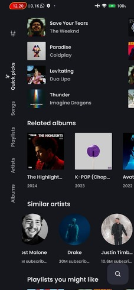

# VrMusic-

   

## Features
- Play (almost) any song or video from YouTube Music
- Background playback
- Cache audio chunks for offline playback
- Search for songs, albums, artists videos and playlists
- Bookmark artists and albums
- Import playlists
- Fetch, display and edit songs lyrics or synchronized lyrics
- Local playlist management
- Reorder songs in playlist or queue
- Light/Dark/Dynamic theme
- Skip silence
- Sleep timer
- Audio normalization
- Android Auto
- Persistent queue
- Open YouTube/YouTube Music links (`watch`, `playlist`, `channel`)
- ...
